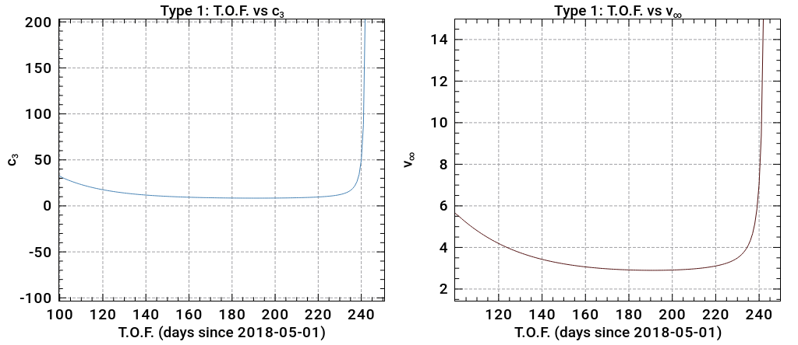

# Lambert solver
*Note:* this was written for ASEN 6008 Space Mission Design, part of Homework 2.

Launching from Earth at 2018-05-01, find potential arrival dates at Mars using a Type 1 and Type 2 transfer.

# Type 1
```
===== type-1 min ======
vInf=2.898841   dur=191
c3=8.403280     dur=191
=======================
```


# Type 2
```
===== type-2 min ======
vInf=2.877067   dur=257
c3=8.277512     dur=257
=======================
```

